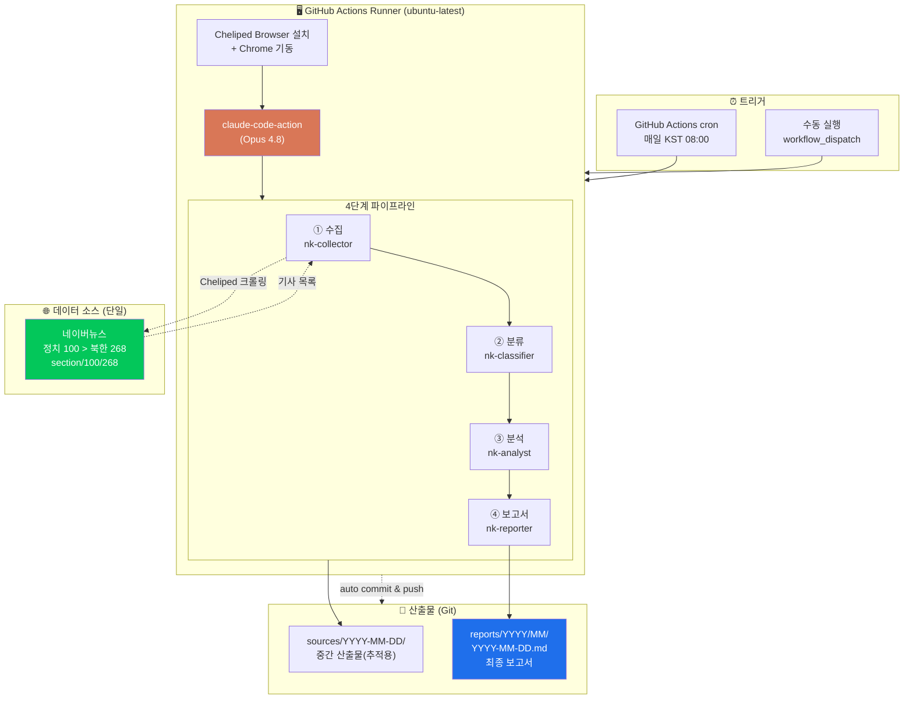
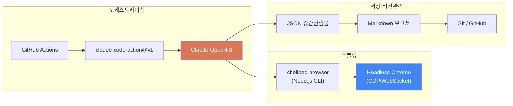
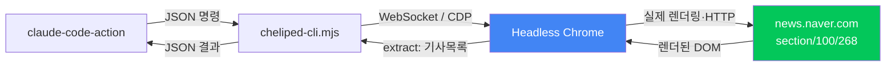
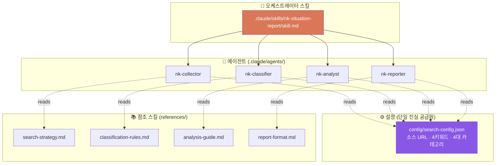
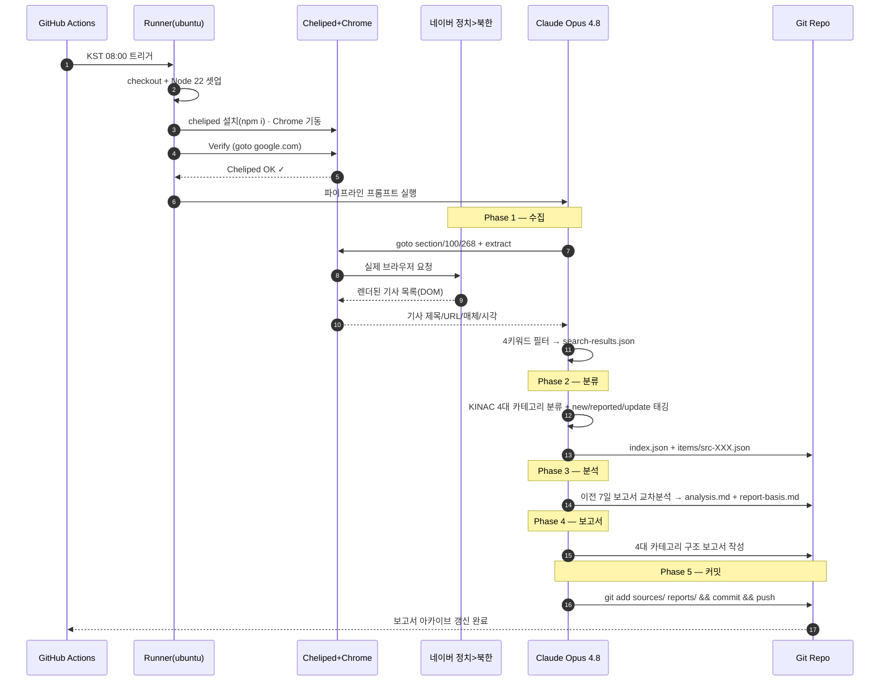
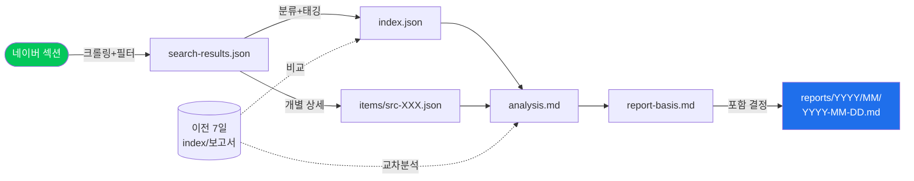
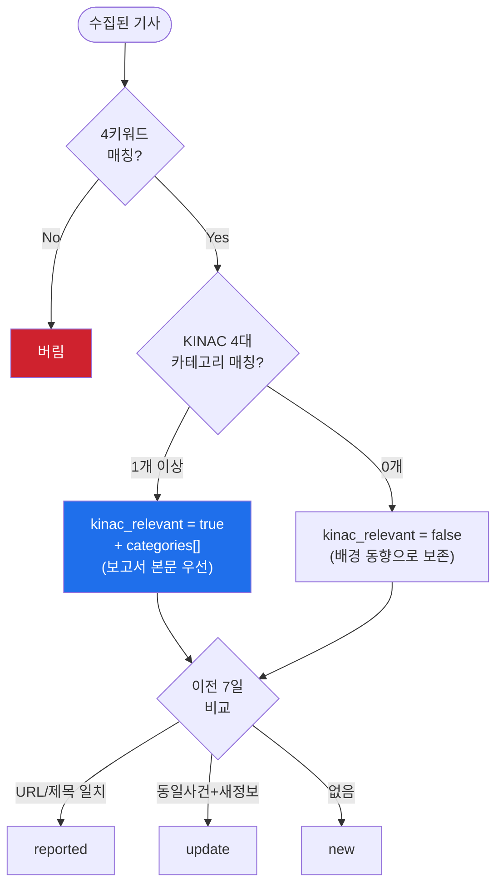
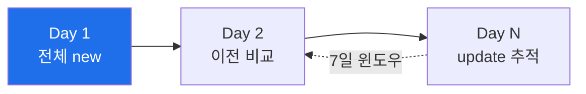

# 기술 아키텍처 — KINAC 북한 핵 상황보고 자동화

원자력통제기술원(KINAC) 요구에 맞춰, **네이버뉴스 정치>북한 섹션**을 매일 크롤링하여 **KINAC 4대 카테고리**로 분류한 일일 상황보고서를 자동 생성하는 시스템의 기술 문서.

> 본 시스템은 광범위 검색 레포 [`north-korean-nuclear-activities`](https://github.com/aifactory-team/north-korean-nuclear-activities)의 4단계 파이프라인을 **단일 소스·한국어·4대 카테고리**로 좁혀 이식한 것이다.

---

## 목차
1. [개념도 (System Overview)](#1-개념도-system-overview)
2. [기술 스택](#2-기술-스택)
3. [왜 브라우저 크롤링인가 (Cheliped)](#3-왜-브라우저-크롤링인가-cheliped)
4. [컴포넌트 아키텍처](#4-컴포넌트-아키텍처)
5. [시퀀스 다이어그램](#5-시퀀스-다이어그램)
6. [4단계 파이프라인 데이터 흐름](#6-4단계-파이프라인-데이터-흐름)
7. [KINAC 분류 알고리즘](#7-kinac-분류-알고리즘)
8. [배포·운영](#8-배포운영)
9. [트러블슈팅 이력](#9-트러블슈팅-이력)

---

## 1. 개념도 (System Overview)



**핵심 설계 원칙 — "좁힘(Narrowing)":**

| 축 | 광범위 레포 | 본 시스템 (KINAC) |
|----|------------|------------------|
| 소스 | 6개 검색엔진 + 6개 해외사이트 | **네이버 정치>북한 섹션 1곳** |
| 언어 | 한·영·일·중 4개국어 | **한국어만** |
| 키워드 | 다국어 12종 | **북한 핵 / 북핵 / 핵실험 / 핵물질** |
| 분류 | 일반 안보 카테고리 | **KINAC 4대 카테고리** |

---

## 2. 기술 스택



| 레이어 | 기술 | 역할 | 비고 |
|--------|------|------|------|
| 실행 환경 | **GitHub Actions** (ubuntu-latest) | 스케줄 트리거, 격리 실행 | cron + workflow_dispatch |
| AI 오케스트레이터 | **claude-code-action@v1** + **Claude Opus 4.8** | 4단계 에이전트 수행, 도구 호출 | `CLAUDE_CODE_OAUTH_TOKEN` 필요 |
| 브라우저 자동화 | **cheliped-browser** (Node.js, `ws` 의존) | 실제 브라우저로 네이버 크롤링 | `goto`/`extract`/`observe`/`close` |
| 브라우저 엔진 | **Headless Chrome** (Chrome DevTools Protocol) | JS 렌더링·DOM 추출 | 러너 기본 설치(`/usr/bin/google-chrome`) |
| 런타임 | **Node.js 22** | cheliped 실행 | (actions checkout@v5/setup-node@v5) |
| 데이터 포맷 | **JSON**(중간) + **Markdown**(보고서) | 추적 가능한 산출물 | frontmatter 포함 |
| 저장소 | **Git / GitHub** | 보고서 아카이브, 자동 커밋 | `reports/YYYY/MM/` |

---

## 3. 왜 브라우저 크롤링인가 (Cheliped)

### 문제: 네이버는 단순 HTTP fetch를 차단한다
- `news.naver.com`은 봇/스크래퍼의 직접 HTTP 요청을 차단한다. (실제로 `WebFetch`로 접근 시 `unable to fetch` 차단 확인)
- 또한 섹션 페이지는 **JavaScript로 기사 목록을 동적 렌더링**하므로, 정적 HTML만 받아서는 기사 목록을 얻을 수 없다.

### 해결: 실제 Chrome을 띄워 사람처럼 접근
**cheliped-browser**는 Chrome DevTools Protocol(CDP)로 헤드리스 Chrome을 제어하는 경량 Node.js CLI다.



**크롤링 명령 (Phase 1):**
```bash
node "$CHELIPED_CLI" '[
  {"cmd":"goto","args":["https://news.naver.com/breakingnews/section/100/268"]},
  {"cmd":"wait","args":["2000"]},
  {"cmd":"extract","args":["all"]},
  {"cmd":"close"}
]'
```

**cheliped 주요 명령:**

| 명령 | 설명 |
|------|------|
| `goto` | URL 이동 후 로드 완료 대기 |
| `wait` | 동적 렌더링 대기(ms) |
| `extract` | 렌더된 DOM에서 기사 제목·URL·매체·시각 추출 |
| `observe` | Agent DOM 추출 및 요소 ID 부여(상호작용용) |
| `close` | 세션 종료 (반드시 호출) |

> **특징:** 최소 의존성(`ws`만), JSON 입출력, 평균 ~1,932 토큰/호출로 토큰 효율적, 첫 호출 시 Chrome 자동 기동.

### 네이버 섹션 URL 구조
```
https://news.naver.com/breakingnews/section/{대분류}/{소분류}
                                              100        268
                                              정치       북한
```

---

## 4. 컴포넌트 아키텍처

에이전트(누가)와 스킬(어떻게)이 분리된 하네스 구조.



| 에이전트 | 참조 스킬 | Phase | 입력 → 출력 |
|----------|----------|-------|------------|
| `nk-collector` | search-strategy.md | 1 | 네이버 섹션 → `search-results.json` |
| `nk-classifier` | classification-rules.md | 2 | search-results → `index.json` + `items/` |
| `nk-analyst` | analysis-guide.md | 3 | index/items → `analysis.md` + `report-basis.md` |
| `nk-reporter` | report-format.md | 4 | 분석 → `reports/YYYY/MM/YYYY-MM-DD.md` |

> **범위 변경 시:** `config/search-config.json` 한 파일만 편집하면 키워드·카테고리·소스가 전 에이전트에 반영된다.

---

## 5. 시퀀스 다이어그램

매일 1회 실행되는 전체 흐름.



---

## 6. 4단계 파이프라인 데이터 흐름



**산출물 디렉토리:**
```
sources/YYYY-MM-DD/
├── search-results.json   # Phase1: 수집 원본(write-only, 추적용)
├── index.json            # Phase2: 경량 인덱스(분류·태깅 요약)
├── items/src-XXX.json    # Phase2: 기사별 상세(카테고리·태그·사유)
├── analysis.md           # Phase3: 카테고리별 연관관계 분석
└── report-basis.md       # Phase3: 포함/제외 결정 근거
reports/YYYY/MM/
└── YYYY-MM-DD.md         # Phase4: 최종 보고서
```

**핵심 스키마 — `items/src-XXX.json`:**
```json
{
  "id": "src-001",
  "title": "...", "url": "https://n.news.naver.com/...",
  "source_name": "뉴스1", "published_at": "YYYY-MM-DD HH:MM",
  "matched_keywords": ["북핵", "핵물질"],
  "categories": ["지역", "핵물질 생산", "핵주기", "핵주기시설"],
  "kinac_relevant": true,
  "category_reason": "영변(지역)+우라늄(핵물질)+농축(핵주기)+농축시설(핵주기시설)",
  "tag": "new",
  "tag_reason": "이전 7일 소스에 동일/유사 항목 없음"
}
```

---

## 7. KINAC 분류 알고리즘

기사 1건에 **2개 라벨**을 독립 부여: ① KINAC 카테고리(무엇에 관한가) ② 중복제거 태그(이전에 봤는가).



**4대 카테고리 키워드 (`config/search-config.json`):**

| 카테고리 | 키워드 |
|----------|--------|
| **지역** | 평산, 강선, 영변, 풍계리 |
| **핵물질 생산** | 우라늄, 플루토늄 |
| **핵주기** | 광산, 정련, 변환, 농축, 제조, 연소, 재처리 |
| **핵주기시설** | 우라늄 농축시설, 원자로, 방사화학실험시설 |

- 한 기사가 **복수 카테고리** 해당 가능 (예: "영변 원자로 재처리" → 지역+핵주기+핵주기시설).
- 키워드는 통과했으나 4대 카테고리 미해당 기사(예: 한미 핵협의그룹)는 **버리지 않고** "배경 동향"으로 분리 보존.

---

## 8. 배포·운영

### 실행 스케줄
```yaml
on:
  schedule:
    - cron: '0 23 * * *'   # UTC 23:00 = KST 08:00
  workflow_dispatch:        # 수동 실행(날짜 지정 가능)
```

### 사전 요구사항 (1회 설정)
| 항목 | 방법 |
|------|------|
| **Claude Code GitHub App** | https://github.com/apps/claude 에서 레포에 설치 (필수 — 미설치 시 OIDC 토큰 교환 401 실패) |
| **시크릿** `CLAUDE_CODE_OAUTH_TOKEN` | 레포 Settings → Secrets |
| Chrome | ubuntu-latest 러너 기본 제공 |

### 운영 흐름

- 첫 실행은 비교 대상이 없어 전부 `new`.
- 이후 매일 이전 7일 `index.json`과 비교하여 중복(`reported`)·후속보도(`update`) 자동 식별.

---

## 9. 트러블슈팅 이력

구축 과정에서 실제로 마주친 이슈와 해결.

| 증상 | 원인 | 해결 |
|------|------|------|
| `WebFetch: unable to fetch news.naver.com` | 네이버가 직접 HTTP/봇 차단 + JS 동적 렌더링 | **cheliped-browser(실제 Chrome)** 로 크롤링 |
| Generate 단계 15초 만에 `401 Unauthorized` | Claude Code GitHub App 미설치 | https://github.com/apps/claude 에서 레포에 앱 설치 |
| `Node.js 20 actions are deprecated` 경고 | checkout@v4/setup-node@v4가 Node 20 기반 | `@v5` + Node 22로 상향 |
| 로컬 샌드박스에서 크롤링 불가 | 로컬에 Chrome/cheliped 환경·네이버 접근 없음 | 운영은 **GHA 러너**에서 수행(로컬은 로직 검증용) |

> 네 번째 이슈는 과거 운영 단계에서 보고된 "크롤링이 안 돈다" 류 문제와 동일한 **실행 환경 의존성**이다. 본 시스템은 크롤링을 GHA 러너에 고정하여 환경 변수를 제거했다.

---

### 참고
- 오케스트레이터: `.claude/skills/nk-situation-report/skill.md`
- 설정: `config/search-config.json`
- 워크플로: `.github/workflows/daily-nk-situation-report.yml`
- 상위 하네스 규칙: `CLAUDE.md`
